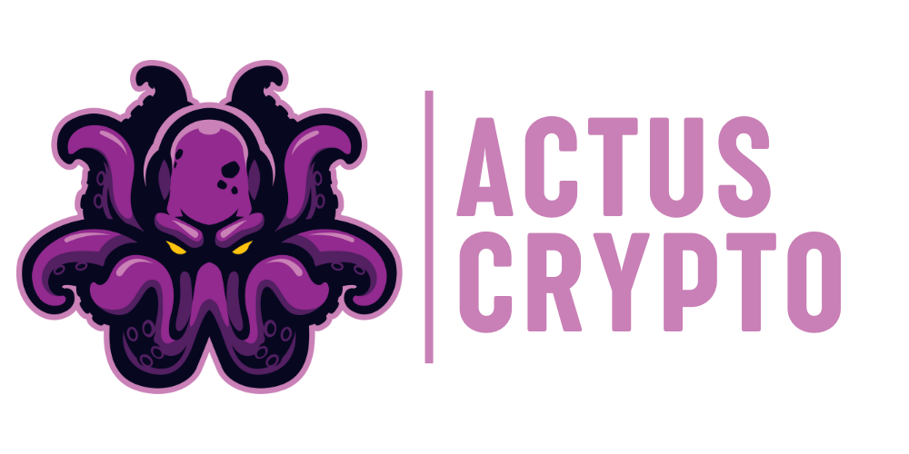

# Projet frontend - Actus Crypto



## Description

Ce projet est un site web qui permet de consulter les actualités sur le cours des cryptomonnaies. Il est possible de consulter les actualités en fonction de la cryptomonnaie choisie.

Ce projet fait partie de la formation Agiliteach "Développement Web Moderne avec l'IA". Disponible sur la plateforme Udemy.

## Technologies utilisées

| Technologies | Usage |
| ------------ | ----- |
| HTML         | Structure de la page |
| CSS          | Mise en forme de la page |
| JavaScript   | Intéraction avec l'API |
| API Binance  | Fournisseur des données |

## Installation

1. Cloner le projet sur votre machine ou téléchargez le fichier zip et décompressez-le.

```bash
git clone https://github.com/Jensone/Actus-Crypto.git
```

1. Installer les extensions recommandées pour le projet, elle sont automatiquement détectées par VSCode et vous pouvez les installer en cliquant sur le bouton "Install All" qui s'affiche en bas à droite de votre écran.

2. Ouvrir le fichier index.html dans votre navigateur avec l'extension **Live Server** de [Ritwick Dey](https://ritwickdey.github.io/vscode-live-server/) ou **Live Preview** de [Microsoft](https://marketplace.visualstudio.com/items?itemName=ms-vscode.live-server).

---
